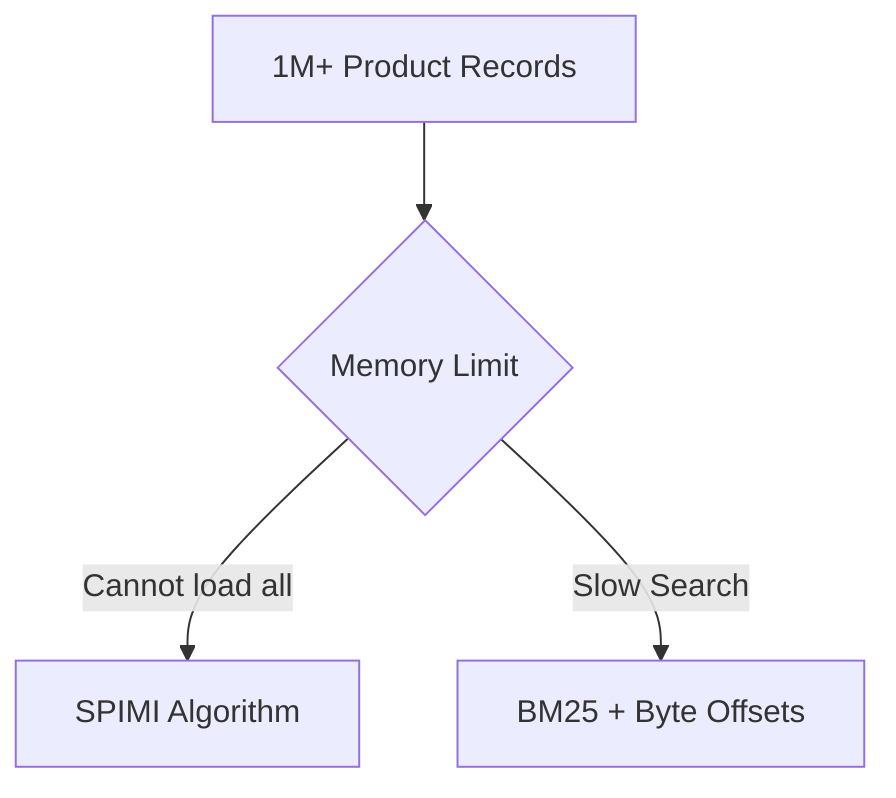
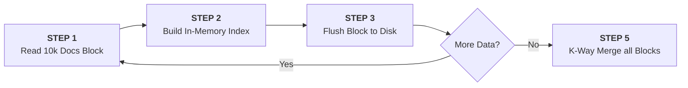
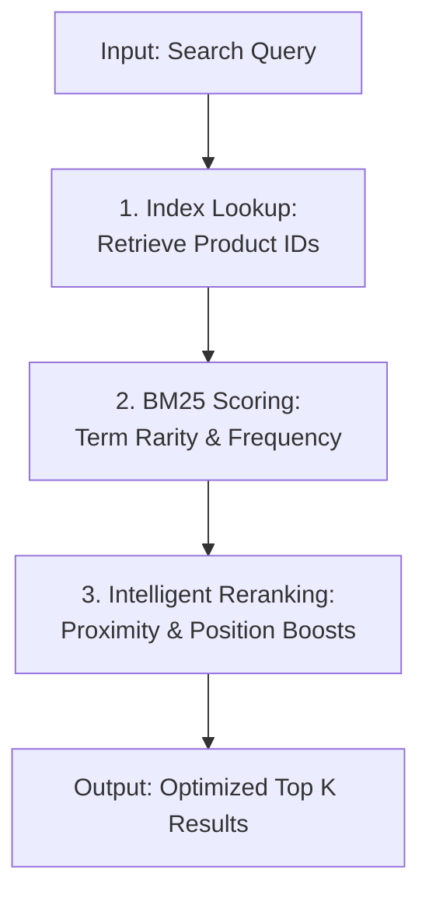

# MILESTONE 2: CORE SEARCH ENGINE IMPLEMENTATION
## Executive Technical Report
**SEG301 — Search Engines & Information Retrieval**
**Project:** Smart Price Comparison Bot
**Team:** phap-bot

---

## 1. Problem Statement
After Milestone 1, the system successfully integrated **1,028,125 product records** from seven e-commerce platforms (~700MB). Managing this scale on standard hardware presents primary challenges:

### The Scaling Challenge


---

## 2. Indexing Architecture: SPIMI Algorithm
To solve memory issues, we implemented the **SPIMI (Single-Pass In-Memory Indexing)** algorithm. This allows the system to build a massive index while staying within defined memory limits.

### Detailed Indexing Workflow


### Core Implementation (`spimi.py`)

#### Block Processing Logic:
```python
def process_block(self, documents: List[Dict]) -> Dict[str, Dict[int, int]]:
    inverted_index = defaultdict(lambda: defaultdict(int))
    for doc in documents:
        doc_id = self.total_docs
        tokens = doc.get('tokens', [])
        for token in tokens:
            sub_tokens = strip_accents(token).split()
            for sub_t in sub_tokens:
                if self._is_valid_term(sub_t):
                    inverted_index[sub_t][doc_id] += 1
        self.total_docs += 1
    return inverted_index
```

#### Memory-Efficient Merging:
```python
def merge_blocks(self):
    # Using heapq for K-way merge to keep memory usage low
    heap = []
    for i, it in enumerate(iterators):
        term, doc_tfs = next(it)
        heapq.heappush(heap, (term, i, doc_tfs))
    
    while heap:
        term, block_idx, doc_tfs = heapq.heappop(heap)
        final_index[term].update(doc_tfs)
        # Load next term from the same block
        next_term, next_doc_tfs = next(iterators[block_idx])
        heapq.heappush(heap, (next_term, block_idx, next_doc_tfs))
```

### Instant Retrieval
We store the **Byte Offset** of every document to jump directly to any product’s data using `f.seek()`.

---

## 3. Search & Ranking: BM25 Algorithm
The system uses the **BM25 (Best Match 25)** ranking function to ensure the most relevant products appear first.

### Retrieval Pipeline


### BM25 Formulation
The score of a document $D$ for a query $Q$ is calculated as:
$$score(D, Q) = \sum_{q \in Q} IDF(q) \cdot \frac{f(q, D) \cdot (k_1 + 1)}{f(q, D) + k_1 \cdot (1 - b + b \cdot \frac{|D|}{avgdl})}$$

where:
*   $f(q, D)$: Term frequency of $q$ in document $D$.
*   $|D|$: Length of document $D$ (word count).
*   $avgdl$: Average document length in the collection.
*   $k_1 = 2.0$ and $b = 0.8$.

### IDF Calculation
$$IDF(q) = \log\left(\frac{N - n(q) + 0.5}{n(q) + 0.5} + 1\right)$$

### Key Ranking Factors
*   **Term Importance (IDF):** Rewards rare terms.
*   **Keyword Saturation:** Prevents score inflation from keyword repeating.
*   **Length Normalization:** Adjusts scores for title length differences.

| Parameter | Value | Role |
| :--- | :--- | :--- |
| **k1** | 2.0 | Limits influence of repeated keywords |
| **b** | 0.8 | Penalizes unnecessarily long titles |

### BM25 Calculation (`bm25.py`)
```python
def calculate_bm25_score(self, query_terms, doc_id, doc_tokens):
    score = 0
    doc_len = len(doc_tokens)
    for term in query_terms:
        if term not in self.inverted_index: continue
        idf = self.calculate_idf(term)
        tf = self.inverted_index[term].get(str(doc_id), 0)
        
        # BM25 Formula Implementation
        numerator = tf * (self.k1 + 1)
        denominator = tf + self.k1 * (1 - self.b + self.b * doc_len / self.avg_doc_length)
        score += idf * (numerator / denominator)
    return score
```

---

## 4. Intelligent Reranking
Custom rules refined for the Vietnamese marketplace.

### Reranking Strategy Map

| Strategy | Goal | Multiplier |
| :--- | :--- | :--- |
| **Proximity Boost** | Bonus for keywords appearing close together | **×1.3 to ×3.0** |
| **Position Boost** | Matches at the start of the product name | **×1.2** |
| **Universal Noise Penalty** | Penalize generic/spammy titles via IDF | **×0.5** |
| **Essential Term Check** | Penalize if key search terms are missing | **×0.1** |

---

## 5. System Performance Results
The system achieves high efficiency on standard hardware:

| Metric | Result |
| :--- | :--- |
| **Total Documents** | 1,028,125 |
| **Total Indexing Time** | 2m 24s |
| **Search Speed** | < 1s |
| **Peak Memory Usage** | < 500MB |
| **Total Index Size** | 175 MB |

---

## 6. Conclusion
Milestone 2 delivers a robust search engine built entirely from scratch. **SPIMI** enables efficient indexing of one million documents, while **Universal BM25** combined with **Intelligent Reranking** ensures high accuracy and flexibility for any product category without relying on hardcoded rules.

**Prepared by Team phap-bot**
